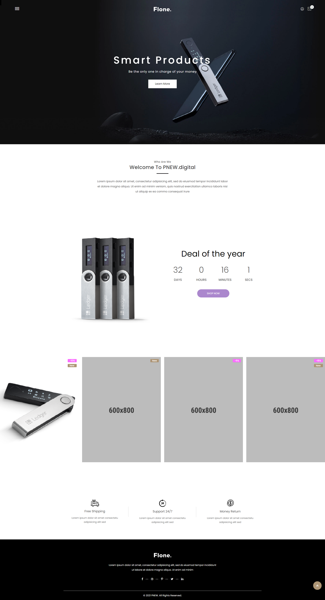

# The E-Commerce Client (React UI)

> The E-Commerce Frontend is a fully-functioning e-commerce application that allows users to register an account, browse products for sale, and complete a purchase.

## Table of contents

* [General info](#general-info)
* [Screenshots](#screenshots)
* [Technologies](#technologies)
* [Setup](#setup)
* [Features](#features)
* [Status](#status)
* [Inspiration](#inspiration)
* [Contact](#contact)

## General info

The purpose of this project is to help me to better understand React, Redux, Jest, Enzyme, the Axios API and to inspire people with valuable content.

## Screenshots



## Technologies

* React - version 17.0.1
* React router-dom - version 5.2.0
* React redux - version 7.1.3
* Redux toolkit - version 1.1.0
* Axios - version 0.21.1
* Bootstrap - version 4.6.0
* Formik - version 2.2.6

## Setup

Please use yarn install & yarn start to run the application in your local environment. Please also install my E-commerce backend.

## Code Examples

Examples of customer slice (incl. thunks for API connection):

```javascript

import { createSlice, createAsyncThunk } from "@reduxjs/toolkit";
import axios from "axios";

// Get Axios base URL from environment variable
axios.defaults.baseURL = process.env.REACT_APP_API_URL;

// The function below is called a thunk and allows us to perform async logic.

export const register = createAsyncThunk(
  "customer/register",
  async (arg, { rejectWithValue }) => {
    try {
      const response = await axios.post("/auth/register", arg);
      console.log("Response:" + response);
      return response.data;
    } catch (err) {
      console.log("Error:" + err);
      return rejectWithValue(err.response.data.message);
    }
  }
);

export const login = createAsyncThunk(
  "customer/login",
  async (arg, { rejectWithValue }) => {
    try {
      const response = await axios.post("/auth/login", arg);
      return response.data;
    } catch (err) {
      return rejectWithValue(err.response.data.message);
    }
  }
);

export const logout = createAsyncThunk(
  "customer/logout",
  async (arg, { rejectWithValue }) => {
    try {
      const response = await axios.get("/auth/logout");
      return response.data;
    } catch (err) {
      return rejectWithValue(err.response.data.message);
    }
  }
);

export const customerSlice = createSlice({
  name: "customer",
  initialState: {
    id: "",
    data: {},
    isLoggedIn: false,
    status: "idle",
    message: null,
  },
  reducers: {},
  extraReducers: {
    [register.pending]: (state, action) => {
      state.status = "loading";
    },
    [register.fulfilled]: (state, action) => {
      state.status = "succeeded";
      state.id = action.payload.customer_id;
      state.isLoggedIn = false;
      state.message = "User account created. Please login.";
      state.data = action.payload;
    },
    [register.rejected]: (state, action) => {
      state.status = "failed";
      state.message = action.payload;
    },
    [login.pending]: (state, action) => {
      state.status = "loading";
    },
    [login.fulfilled]: (state, action) => {
      state.status = "succeeded";
      state.id = action.payload.customer_id;
      state.isLoggedIn = true;
      state.message = null;
      state.data = action.payload;
    },
    [login.rejected]: (state, action) => {
      state.status = "failed";
      state.message = action.payload;
    },
    [logout.pending]: (state, action) => {
      state.status = "loading";
    },
    [logout.fulfilled]: (state, action) => {
      state.status = "idle";
      state.id = "";
      state.isLoggedIn = false;
      state.data = {};
      state.message = null;
    },
    [logout.rejected]: (state, action) => {
      state.status = "failed";
      state.message = action.payload;
    },
  },
});

export const selectCustomer = (state) => state.customer;

export default customerSlice.reducer;

```

## Features

List of features ready and TODOs for future development

* Landing page
* Product detail page (incl. backend integration)
* Shopping cart page
* Login / register / logout page (incl. backend integration)
* Checkout page

To-do list:

* Integrate cart & order endpoints into Redux
* Order management & history page
* Exchange demo product content
* 3rd party login via Google and Amazon
* Process payments via Stripe and Paypal
* Manage user account data
* Test cases for frontend
* Deploy frontend to Heroku
* Connect shop to fancy URL

## Status

Project is: _wip_

## Inspiration

Thanks to Codecademy for providing inspiring content.

## Contact

Created by [@pwagnerde](https://www.linkedin.com/in/pwagnerde/) - feel free to contact me!
